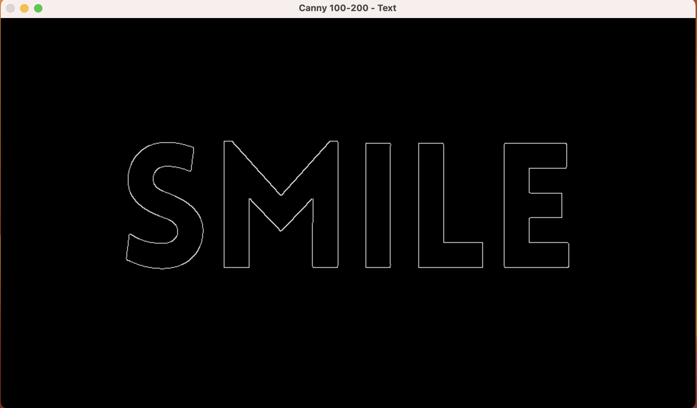

# Edge Detection Assignment - CLEMENT OLIVES

## Objective
The purpose of this assignment was to apply **edge detection techniques** (Canny and Sobel) on multiple images (Text, Landscape, and Face) and compare their results using different thresholds.

## Results and Observations

### Sobel Operator

* Produces **more pixel-level details** and highlights texture.
* Often results in noisy outputs with less clear object boundaries.

### Canny Edge Detector

* Produces **clearer and sharper edges** compared to Sobel.
* Less noisy and easier to identify main outlines of objects.
* Threshold comparisons:

  * **50–150**: detects many edges but adds noise.
  * **100–200**: balanced but still contains extra edges.
  * **150–300**: the **smoothest and most accurate**, giving a cleaner outline.

---

## Conclusion

* The **Canny detector** is more effective than Sobel for clean edge detection.
* Sobel shows intensity variations but does not produce smooth edges.
* The **150–300 Canny threshold** gave the **best overall results** for this assignment.

---

## Screenshots

### Text Image

* Original
  

* Canny 50–150
  

* Canny 100–200
  

* Canny 150–300
  

* Sobel
  


## Trackbar Demo

An interactive trackbar window was also created using OpenCV, 
allowing dynamic adjustment of thresholds in real-time.

Press ANY KEY to close the trackbar window.


## How to Run

### 1. Install Requirements
Make sure you have Python and pip installed. Then install OpenCV:
```bash
pip install opencv-python
````

### 2. Save the Code

Save the Python file as **`edge_detection.py`** 
### 3. Prepare Images

Put your images in the same folder as the script:

* `text.jpg`
* `landscape.webp`
* `face.jpg`

### 4. Run the Script

```bash
python edge_detection.py # for windows users
python3 edge_detection.py # for mac users
```

* Press any key to move from one image’s results to the next.


---


